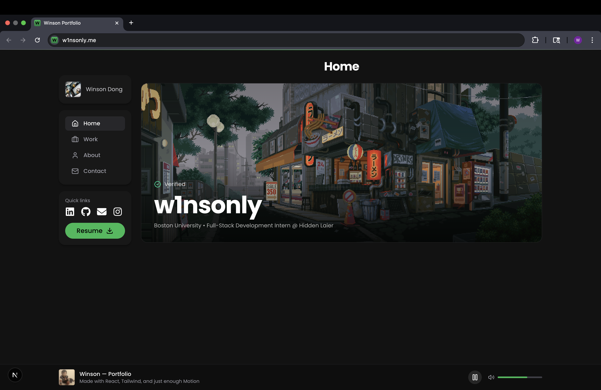

# Spotify-Style Portfolio 🎵

A personal portfolio site inspired by Spotify’s design language — showcases projects, experience, and contact info.  

🔗 **Live Demo:** [https://w1nsonly.me](https://w1nsonly.me)  
🖼️ **Preview:** 


---

## 🚀 Powered By
- Next.js + React  
- Tailwind CSS  
- Framer Motion  
- Lucide / react-icons

## Run Locally
```bash
git clone https://github.com/w1nsonly/spotify-portfolio.git
cd spotify-portfolio
npm install
npm run dev
open http://localhost:3000
```

## 👤 Author
Built by **Winson Dong**  
- GitHub: [@w1nsonly](https://github.com/w1nsonly)  
- LinkedIn: [Winson Dong](https://www.linkedin.com/in/winsondong)  


